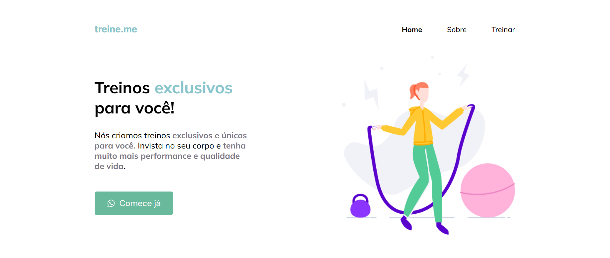

# Projeto Landing Page

## Esse é um projeto feito com o intuito de botar em prática habilidades em HTML5 e CSS3, além de usar algumas técnicas de responsividade.

#### WEB

#### Mobile
<h1 align="center">
  
</h1>

## 🛠 Habilidades
As seguintes tecnologias foram usadas na construção do projeto:

- HTML5
- CSS3

## Aprendizados

Utilização de Media-Queries para responsividade, além de melhora na utilização de flex, para posicionamento de elementos na tela.

## 🔗 Entre em contato

<h4 align="center"> 
	🚧  Projeto em aprimoramento...  🚧
</h4>
